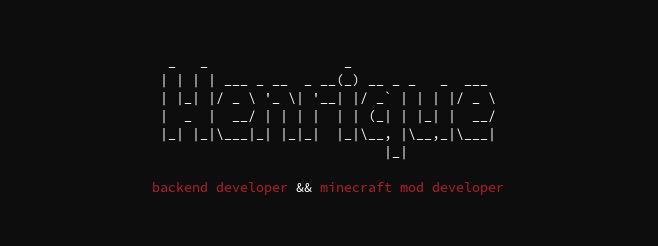

  

  <samp>
      - backend developer 
      - minecraft mod developer 
      - linux power user  
      skills: 
        - langs: javascript, typescript, java. 
        - techs: spring framework, express.js, mySQL, postgreSQL, docker, react.js, next.js, angular, bootstrap. 
        - tools: intellij, apidog, postman, visual studio code.  
      portfolio: https://henriquedev.vercel.app/
  </samp>

